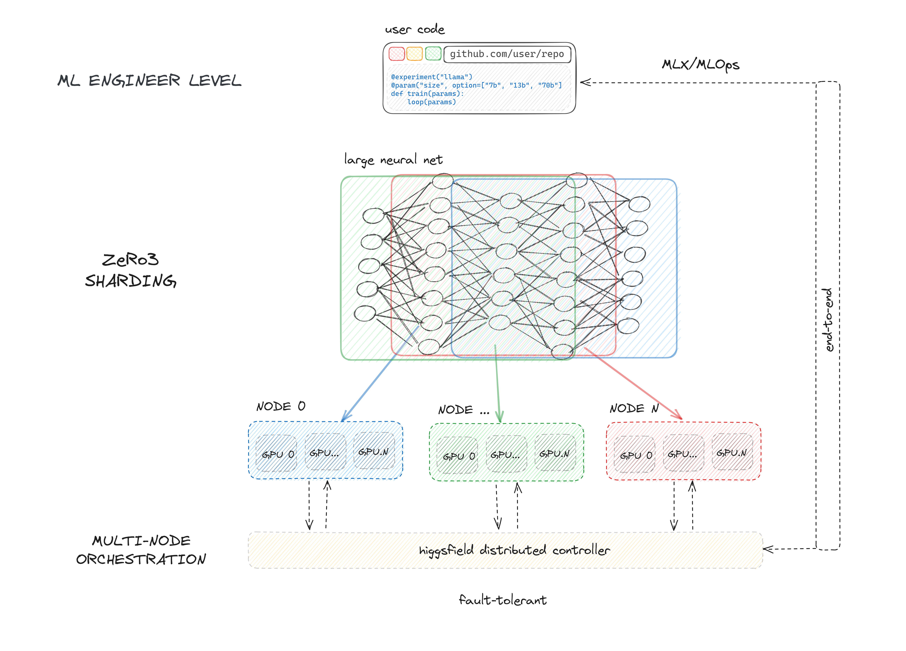

# higgsfield - multi node training without crying
Now you can setup LLaMa2 70b SFT in 5 minutes.

[](https://badge.fury.io/py/higgsfield)

## Install
```bash
$ pip install higgsfield
```

## Why?
- **easy to setup** - 5 minutes to setup your environment and start training on your nodes.
- **easy to use** - 5 lines of code to define an experiment.
- **easy to scale** - 5 minutes to add a new node.
- **easy to reproduce** - 5 minutes to reproduce an experiment.
- **easy to track** - 5 minutes to track your experiments.


## Train example
That's all you have to do in order to train LLaMa in a distributed setting:
```python
from higgsfield.llama import Llama70b
from higgsfield.loaders import LlamaLoader
from higgsfield.experiment import experiment

import torch.optim as optim
from alpaca import get_alpaca_data

@experiment("alpaca")
def train(params):
    model = Llama70b(zero_stage=3, fast_attn=False, precision="bf16")

    optimizer = optim.AdamW(model.parameters(), lr=1e-5, weight_decay=0.0)

    dataset = get_alpaca_data(split="train")
    train_loader = LlamaLoader(dataset, max_words=2048)

    for batch in train_loader:
        optimizer.zero_grad()
        loss = model(batch)
        loss.backward()
        optimizer.step()

    model.push_to_hub('alpaca-70b')
```

## How it's all done?

1. We install all the required tools in your server (Docker, your project's deploy keys, higgsfield binary).
2. Then we generate deploy & run workflows for your experiments.
3. As soon as it gets into Github, it will automatically deploy your code on your nodes.
4. Then you access your experiments' run UI through Github, which will launch experiments and save the checkpoints.


## Design
We follow the standard pytorch workflow. Thus you can incorporate anything besides what we provide, `deepspeed`, `accelerate`, or just implement your custom `pytorch` sharding from scratch. 

**Enviroment hell**

No more different versions of pytorch, nvidia drivers, data processing libraries. 
You can easily orchestrate experiments and their environments, document and track the specific versions and configurations of all dependencies to ensure reproducibility.

**Config hell** 

No need to define [600 arguments for your experiment](https://github.com/huggingface/transformers/blob/aaccf1844eccbb90cc923378e3c37a6b143d03fb/src/transformers/training_args.py#L161). No more [yaml witchcraft](https://hydra.cc/).
You can use whatever you want, whenever you want. We just introduce a simple interface to define your experiments. We have even taken it further, now you only need to design the way to interact.

## Compatibility
**We need you to have nodes with:**
 - Ubuntu
 - SSH access
 - Non-root user with sudo privileges (no-password is required)

**Clouds we have tested on:**
 - LambdaLabs
 - FluidStack

Feel free to open an issue if you have any problems with other clouds. 


## Getting started

#### [Setup](./setup.md)
Here you can find the quick start guide on how to setup your nodes and start training.

#### [Tutorial](./tutorial.md)
API for common tasks in Large Language Models training. 

| Platform | Purpose | Estimated Response Time | Support Level |
| -------- | ------- | ----------------------- | ------------- |
| [Github Issues](https://github.com/higgsfield/higgsfield/issues/) | Bug reports, feature requests, install issues, usage issues, etc. | < 1 day | Higgsfield Team |
| [Twitter](https://twitter.com/higgsfield_ai/) | For staying up-to-date on new features. | Daily | Higgsfield Team |
| [Website](https://higgsfield.ai/) | Discussion, news. | < 2 days | Higgsfield Team |
